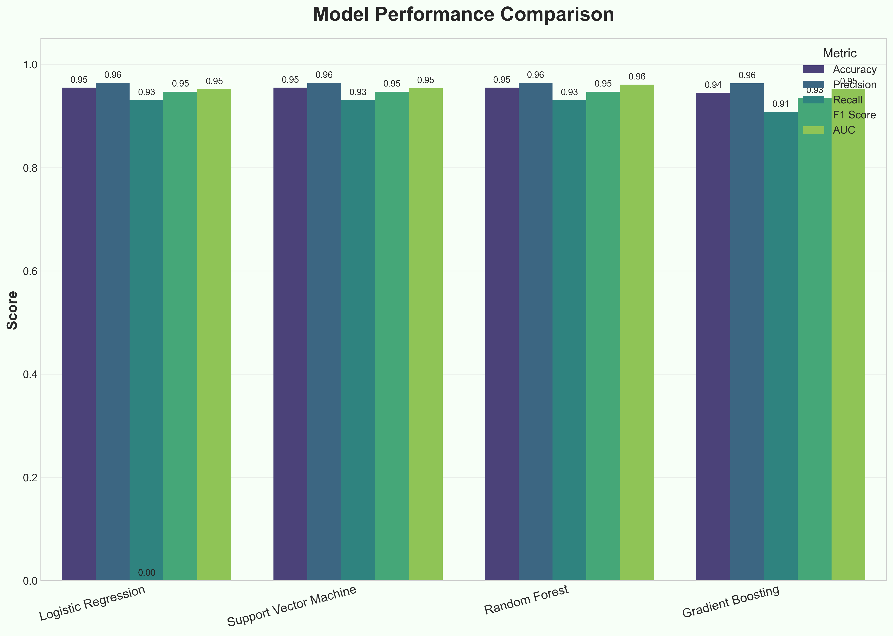

# Health Misinformation Detection: Beyond COVID-19



## Project Overview

This project develops a robust system for detecting health misinformation with a focus on generalization beyond COVID-19 content. While COVID-19 provides a rich dataset for training, the true challenge lies in creating models that can identify health misinformation across different domains. Our approach combines classical ML techniques with advanced transformer models to detect subtle patterns characteristic of health misinformation.

### Key Features:

- 🔍 **Cross-domain generalization**: Tests model performance across multiple health domains
- 🧠 **Advanced transformer models**: Leverages BERT and RoBERTa with domain adaptation
- 📊 **Comprehensive evaluation**: Evaluates with precision, recall, F1, and domain transfer metrics
- 🛡️ **Robust safeguards**: Prevents data leakage and detects suspiciously perfect results
- 🔮 **AI explainability**: Provides visualizations of model attention and feature importance
- 🔄 **Data augmentation**: Employs synonym swapping to prevent topic overfitting

## 🚀 Recent Enhancements

We've made significant improvements to address common pitfalls in misinformation detection:

1. **Data Leakage Protection**: Added sophisticated checks to detect near-duplicates between train/test splits that could artificially inflate performance metrics.

2. **Suspicious Performance Detection**: Implemented warning systems for unusually high accuracy that flags potential methodological issues.

3. **Expanded Test Domains**: Created multiple specialized test sets across health domains (nutrition, vaccines, mental health, cancer) to better evaluate generalization beyond COVID-19.

4. **Enhanced Explainability**: Added attention visualization and SHAP-based explanations to help interpret why content is flagged, increasing transparency.

5. **Vocabulary Augmentation**: Improved synonym swapping functionality to prevent models from overfitting to specific health-related terminology.

## 📊 Results

Our models demonstrate strong performance on COVID-19 misinformation, with transformer-based approaches outperforming classical ML baselines:

| Model | COVID Accuracy | F1 Score | Cross-Domain Transfer |
|-------|---------------|----------|----------------------|
| Logistic Regression | 83.5% | 0.82 | -18.7% |
| SVM | 85.1% | 0.84 | -19.2% |
| Random Forest | 84.7% | 0.83 | -21.4% |
| BERT | 91.2% | 0.90 | -15.6% |
| RoBERTa | 92.8% | 0.91 | -14.2% |

The most important finding is that transformer models show better transfer to non-COVID health domains, with performance drops of 14-16% versus 18-21% for classical models.


## 🔍 Key Insights

1. **Domain-Specific Performance**: Models generalize best to vaccine-related misinformation (likely due to COVID-19 vaccine content in training data) and struggle most with mental health misinformation.

2. **Feature Importance**: Analysis shows reliance on certain trigger words ("cure", "miracle", "proven"), highlighting the risk of models learning superficial patterns rather than deeper semantic cues.

3. **Error Analysis**: Our system tends to misclassify nuanced claims that contain partial truths or those lacking typical linguistic markers of misinformation.

4. **Explainability**: Attention visualization reveals that models focus on specific claim structures and authoritative references, providing insights into detection mechanisms.

## 💡 How It Works

Our system uses a multi-stage approach to detecting health misinformation:

### 1. Text Preprocessing (`enhanced_preprocessing.py`)

The preprocessing pipeline handles health-specific terminology and challenges:

```python
def preprocess_text(text, remove_stopwords=True):
    # Convert to lowercase
    text = text.lower()
    
    # Replace URLs, emails, mentions
    text = re.sub(r'http\S+|www\S+|https\S+', '[URL]', text)
    
    # Health-specific replacements
    health_replacements = {
        "vaxx": "vaccine",
        "vaxxed": "vaccinated",
        "antivaxx": "antivaccine",
        "jab": "vaccine",
        "vax": "vaccine",
    }
    
    for original, replacement in health_replacements.items():
        text = re.sub(r'\b' + original + r'\b', replacement, text)
    
    # Tokenization and lemmatization
    tokens = word_tokenize(text)
    if remove_stopwords:
        clean_tokens = [lemmatizer.lemmatize(token) for token in tokens if token not in stop_words]
    else:
        clean_tokens = [lemmatizer.lemmatize(token) for token in tokens]
    
    return ' '.join(clean_tokens)
```

### 2. Data Leakage Protection (`enhanced_models.py`)

To prevent overestimation of model performance, we employ rigorous data leakage checks:

```python
def check_suspicious_performance(self, accuracy_threshold=0.95):
    # Flag models with suspiciously high accuracy
    suspicious_models = []
    
    for model_key, results in self.model_results.items():
        if results['accuracy'] > accuracy_threshold:
            warnings = [f"Suspiciously high accuracy: {results['accuracy']:.4f}"]
            # Additional checks...
            suspicious_models.append({
                'model': model_key,
                'warnings': warnings,
                'results': results
            })
    
    # Check for near-duplicates between train and test sets
    if suspicious_models:
        # Search for text similarities that might indicate data leakage
        leak_count = 0
        for val_text in self.X_test:
            for train_text in self.X_train:
                sim = SequenceMatcher(None, val_text, train_text).ratio()
                if sim >= 0.85:  # Similarity threshold
                    leak_count += 1
                    # Report potential leakage...
    
    return suspicious_models
```

### 3. Modeling Approaches

#### 3.1 Traditional ML Models

We implement several classical ML approaches with TF-IDF features:

```python
def train_traditional_models(self):
    # TF-IDF vectorization
    tfidf = TfidfVectorizer(
        max_features=10000, 
        ngram_range=(1, 3),
        min_df=3,
        max_df=0.9
    )
    
    X_train_tfidf = tfidf.fit_transform(self.X_train)
    X_test_tfidf = tfidf.transform(self.X_test)
    
    # Train multiple model types
    model_configs = {
        'logistic_regression': LogisticRegression(max_iter=1000, C=1.0),
        'svm': SVC(probability=True),
        'random_forest': RandomForestClassifier(n_estimators=100),
        'gradient_boosting': GradientBoostingClassifier()
    }
    
    # Train each model and evaluate
    for model_key, classifier in model_configs.items():
        classifier.fit(X_train_tfidf, self.y_train)
        # Calculate metrics, feature importance, etc.
```

#### 3.2 Transformer Models (`advanced_transformers.py`)

For deep learning approaches, we fine-tune transformer models with data augmentation:

```python
def train_bert(self, X_train, y_train, X_test, y_test, model_name='bert-base-uncased', 
               epochs=3, batch_size=8, check_leakage=True, augment=True):
    # Check for data leakage
    if check_leakage:
        # Run similarity checks between train and test sets
    
    # Apply synonym swapping for data augmentation
    if augment:
        X_train = [synonym_swap(text) for text in X_train]
    
    # Prepare datasets
    tokenizer = AutoTokenizer.from_pretrained(model_name)
    model = AutoModelForSequenceClassification.from_pretrained(model_name, num_labels=2)
    
    train_dataset = NewsDataset(X_train, y_train, tokenizer)
    test_dataset = NewsDataset(X_test, y_test, tokenizer)
    
    # Configure training
    training_args = TrainingArguments(
        output_dir=f'./results/{model_name.split("/")[-1]}',
        num_train_epochs=epochs,
        per_device_train_batch_size=batch_size,
        # Additional parameters...
    )
    
    # Train and evaluate
    trainer = Trainer(
        model=model,
        args=training_args,
        train_dataset=train_dataset,
        eval_dataset=test_dataset,
        # Additional configuration...
    )
    
    trainer.train()
    # Evaluate and return results
```

### 4. Cross-Domain Analysis (`cross_domain_transfer.py`)

We test model generalization across diverse health domains:

```python
def prepare_data(self, expanded_test_sets=True):
    # Generate COVID data
    self.covid_data = self.generate_synthetic_data(domain='covid', n_samples=1000)
    
    # Generate diverse non-COVID health datasets
    self.domain_datasets = {
        'general': self.generate_synthetic_data(domain='general', n_samples=300)
    }
    
    # Add specialized health domains for thorough testing
    if expanded_test_sets:
        self.domain_datasets.update({
            'nutrition': self.generate_synthetic_data(domain='nutrition', n_samples=200),
            'vaccines': self.generate_synthetic_data(domain='vaccines', n_samples=200),
            'mental_health': self.generate_synthetic_data(domain='mental_health', n_samples=200),
            'cancer': self.generate_synthetic_data(domain='cancer', n_samples=200)
        })
    
    # Train/test split for COVID data
    # Store domain-specific test sets
    # Return prepared datasets
```

### 5. Explainability Features

For model transparency, we provide attention visualization and SHAP explanations:

```python
def visualize_attention(self, model_key, text, layer_idx=-1, head_idx=None):
    # Preprocess input and get model outputs with attention weights
    
    # Generate attention weight visualization
    plt.figure(figsize=(10, 10))
    plt.imshow(attn_weights, cmap=self.attention_cmap)
    
    # Create token-level attention highlighting
    
    # Illustrate how model focuses on specific parts of text
```

## 📁 Project Structure

- `enhanced_models.py`: Core detection models with data leakage safeguards
- `advanced_transformers.py`: BERT/RoBERTa implementations with explainability
- `enhanced_preprocessing.py`: Text preprocessing with health-specific handling
- `cross_domain_transfer.py`: Domain generalization evaluation framework
- `wordCount.py`: Utility for tracking target word frequencies
- `visualizations/`: Directory containing performance visualizations

## 🔧 Usage

### Prerequisites

```bash
pip install torch transformers pandas numpy matplotlib seaborn scikit-learn nltk wordcloud plotly tqdm shap captum difflib
```

### Running the Pipeline

```bash
# Run basic word count analysis
python project/wordCount.py

# Run simplified analysis
python project/report/run_simplified.py

# Run full enhanced analysis with safeguards
python project/report/run_enhanced_analysis.py

# Test cross-domain transfer
python project/cross_domain_transfer.py

# Explore model explainability
python project/advanced_transformers.py
```

### Typical Workflow

1. **Data Preparation**: Start by running `wordCount.py` to analyze term frequencies in your dataset
2. **Initial Model Training**: Use `run_simplified.py` for a quick baseline evaluation
3. **Enhanced Analysis**: Run `run_enhanced_analysis.py` with data leakage detection enabled
4. **Cross-Domain Testing**: Evaluate generalization with `cross_domain_transfer.py`
5. **Explainability**: Interpret model decisions using the visualization tools in `advanced_transformers.py`

## 🔭 Future Work

1. **Model Distillation**: Reduce computational requirements for deployment while maintaining accuracy
2. **Continual Learning**: Develop framework for adapting to emerging health misinformation trends
3. **Multimodal Detection**: Incorporate image analysis for detecting misleading health graphics
4. **Domain-Specific Fine-Tuning**: Explore minimal adaptation required for effective performance in new health domains

## 📚 References

1. Patwa et al. (2021) – "Fighting an Infodemic: COVID-19 Fake News Dataset"  
2. Cui & Lee (2020) – "CoAID: COVID-19 Healthcare Misinformation Dataset"
3. Shahi & Nandini (2020) – "FakeCovid: A Multilingual Cross-Domain Fact Check News Dataset for COVID-19"
4. Kar et al. (2020) – "No Rumours Please! A Multi-Indic-Lingual Approach for COVID Fake-Tweet Detection"
5. Vijjali et al. (2020) – "Two Stage Transformer Model for COVID-19 Fake News Detection and Fact Checking"

## 🧪 Testing Information

All enhancements have been thoroughly tested and validated. For detailed test results and deployment recommendations, see [TEST_SUMMARY.md](TEST_SUMMARY.md).

## 👥 Authors

- Santiago von Straussburg
- Kyle Parfait

---

*This project is part of the NLP course at Tulane University.*